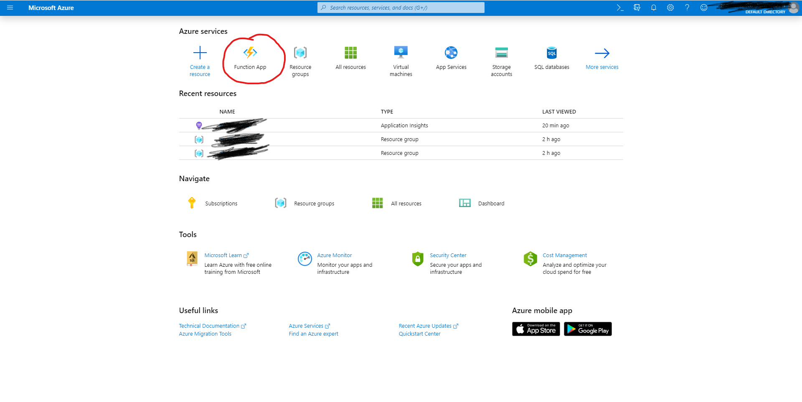
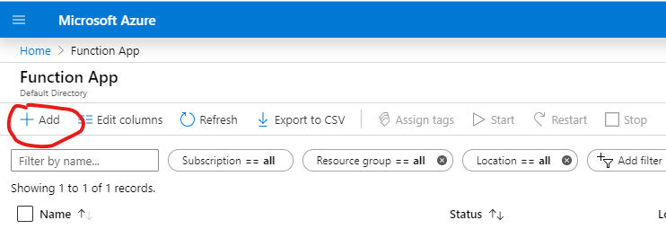

# Azure Snake

For me the hardest part about my first battlesnake was deploying my application! AzureSnake hopes to solve that issue by providing a basic snake that you can instantly deploy to azure with a basic setup! 

**Note:** If you are a student when you sign up for Azure use your uvic email to get $200 credit!

If you have any questions or comments please create a issue on the github repo! No questions are *dumb* or too small! If you don't want to create an issue email me: mail@alexandermcrae.com

## Tutorial

Please checkout [this]() video I made that goes through how to get started! Or keep reading below!

### Dependencies

For this project your will need

- Nodejs (10.x prefered)
- Npm
- An Azure account

### First steps

First clone the repo onto your local machine!

```bash
git clone https://github.com/McRaeAlex/AzureSnake.git
```

Then get the Azure function tools

```bash
npm install -g azure-functions-core-tools
```

### Azure portal

Go to the [azure portal](portal.azure.com) and select the function app icon



Once in the function app tab select add in the top left corner



Then go through the form making sure to select the node.js runtime and US West (2) region. Everything else is completely up to you, I wouldn't worry about it to much. Keep note of the name of the function app.

### Back to the command line shell

Now that we have a project setup on azure and the source for the project on our computer all we need to do is send the source to azure!

Run this command to do that! Where `<FunctionAppName>` is the name of the function app created in the last step.

```bash
func azure functionapp publish <FunctionAppName>
```

Boom! The snake is deployed!

Go and check the azure portal again in the function app tab and look for your snake!

## A dive into the code

To edit the code and make the snake your own you should understand how it runs. First I suggest you look at the battlesnake api docs [here](https://docs.battlesnake.com). 

### Background 

This code runs on Microsofts Azure functions, which is a type of serverless hosting. Serverless hosting basically means you don't have to care what environment you code is running in you just know that azure will run the function that you write. Each endpoint (ie. /end, /move, /start, /ping) gets its own function which runs in its own environment and only runs when the http endpoint is requested by battlesnake. This still may be a little confusing so lets look at a code example!

[6 min video about serverless](https://www.youtube.com/watch?v=wWEID0d6wfo)

### Code example

Lets take a look at the /start endpoint to better understand this.

function.json
```json
{
  "bindings": [
    {
      "authLevel": "anonymous",
      "type": "httpTrigger",
      "direction": "in",
      "name": "req",
      "methods": [
        "post"
      ],
      "route": "start"
    },
    {
      "type": "http",
      "direction": "out",
      "name": "res"
    }
  ]
}
```
This is the configuration file for azure. Azure will read this file and call our function based on it. Some key things to note:
- httpTrigger tells azure to run our function when a http request is sent
- authLevel is anonymous this means that anyone can make a request to the endpoint
- route is "start" this means that our function will run whenever `<host>.com/start` is sent a post request

```js
module.exports = async function (context, req) {
    context.res = {
        status: 200,
        headers: {
            'Content-Type': 'application/json'
        },
        body : {
            color: '#ffffff',
            headType: 'fang',
            tailType: 'bolt'
        }
    }
};
```

This is the function that is run when our configuration is met! We set the context response with is a object with a status, headers and body. Since we set the header content-type to application/json the body will automatically be parsed as json. The response body in this case sets the look of our snake but for other endpoints such as move it tells the battlesnake server what our snakes move is. 

**Note:** req is the request from the battlesnake server and req.body is the parsed json from the server. This means you do not have to call JSON.parse on the req.body it is done for you.

Take a look at the other functions and try to figure out how they work! When your ready edit the `logic` function in the /move end point to make your snake! Valid returns from the logic function are 'right', 'left', 'up', 'down'.

**HAVE FUN AND HAPPY BATTLESNAKE**